# Dijkstra
The Ruby on Rails 6 project where I had fun :
- using [Dijkstra's algorithm](https://en.wikipedia.org/wiki/Dijkstra%27s_algorithm)
- testing [Bulma](https://bulma.io/) open source CSS framework
- discovering how to easily [deploy on Heroku](https://devcenter.heroku.com/articles/getting-started-with-rails6)
- analyzing  Jithin's [graph.rb](https://gist.github.com/jithinabraham/63d34bdf1c94a01d6e91864d4dc583f4)

## Mockup

> Project's [live demo](https://dijkstra-piralimic.herokuapp.com/) on Heroku

### Welcome Page
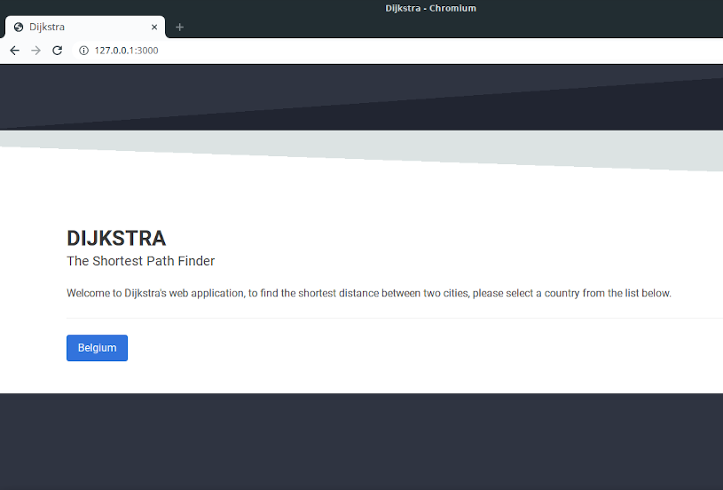
### Selected Country Page
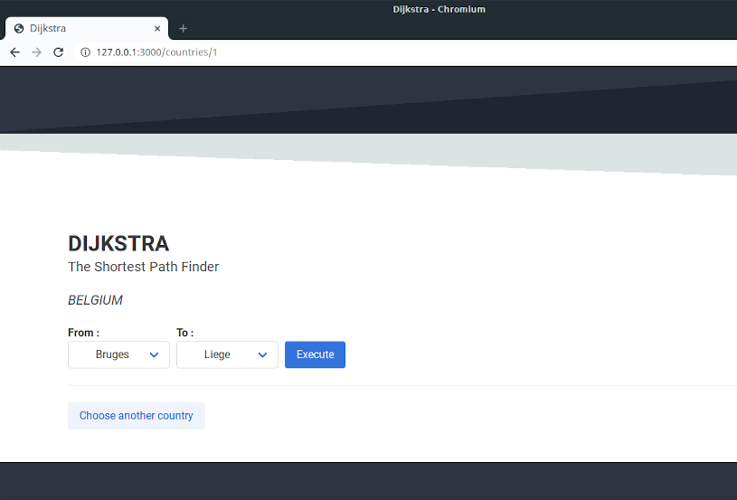
### Algorithm Response
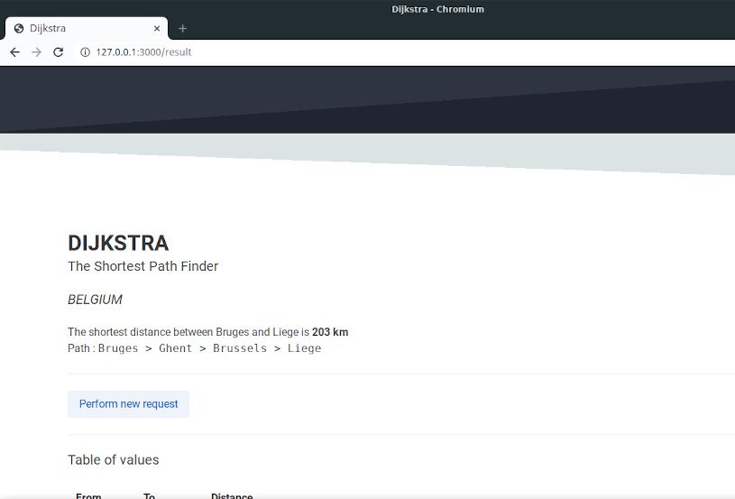
### Table of values
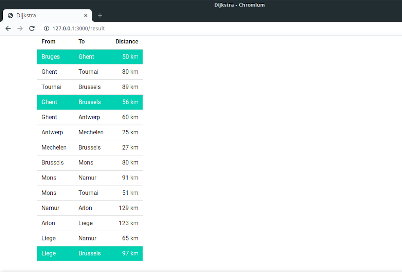

## Instructions
By creating a new Rails app that you will call Dijkstra, I would like you to:
- Find a DB modelization that allows you to store any country given its cities and its roads between them (see Belgian graph);
- Store the Belgian data (see [belgium.rb](belgium.rb));
- Allow a user to select Belgium as a country (or if he/she navigates to /countries/belgium), then allow to select a starting point (a Belgian city) and a destination (also a Belgian city);
- Once the user has selected the starting point and the destination, tell the shortest distance between those two cities;
- Describe to the user the path (for example: Bruges -> Ghent -> Brussels -> Liège) that corresponds to the shortest distance you returned to the user;
- Make your code shines!

### Test and code comprehension
> CODE PLAYGROUND : [belgium.rb](https://code.sololearn.com/cIL8G5BYJvyu)

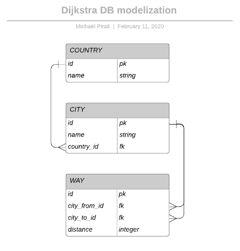

### Active Record Associations
- a Country has many Cities
- a City belongs to a Country
- a City has many Ways
- a Way belongs to a City (`city_from_id` OR `city_to_id`)
- a Country has many Ways through Cities

#### Binding Scenario I
> Irreversible action

When a City is `destroyed` > all depended roads should be `destroyed` too
<br>
<br>
When a Road is `destroyed` > only the specific road should be `destroyed`

#### Binding Scenario II
> Safer solution

When a City is `destroyed` > all depended roads should be `archived` and no more available but should still be `edited` and `reestablished`
<br>
<br>
When a Road is `destroyed` > only the specific road should be `archived` and no more available but should still be `edited` and `reestablished`
<br>

## Algorithm explanation

### The shortest distance between Bruges and Liege

#### First Step
Initialize the distance as infinite from *source* city.
<br>
```Ruby
visited = []
unvisited = [:bruges,:ghent,:antwerp,:tournai,:mechelen,:brussels,:mons,:namur,:liege,:arlon]
```
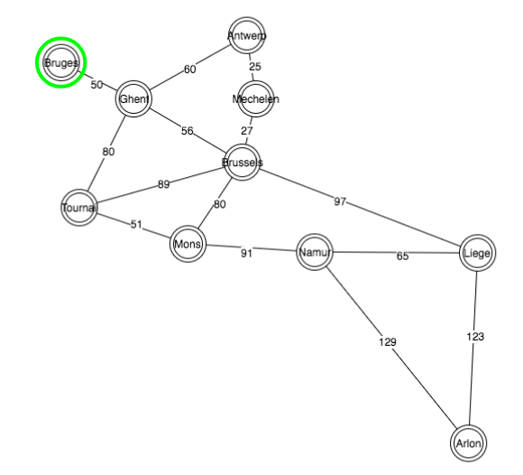
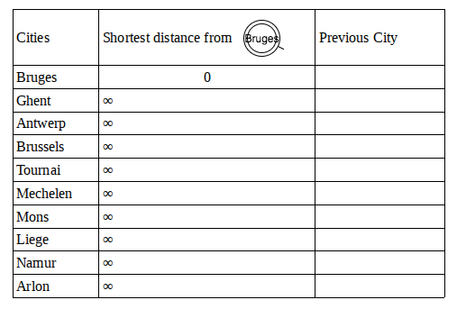

#### Next Step : neighbors of Bruges
Only one neighbor, the distance is by default `saved` as the shortest distance.
<br>
```Ruby
visited = [:bruges]
unvisited = [:ghent,:antwerp,:tournai,:mechelen,:brussels,:mons,:namur,:liege,:arlon]
```
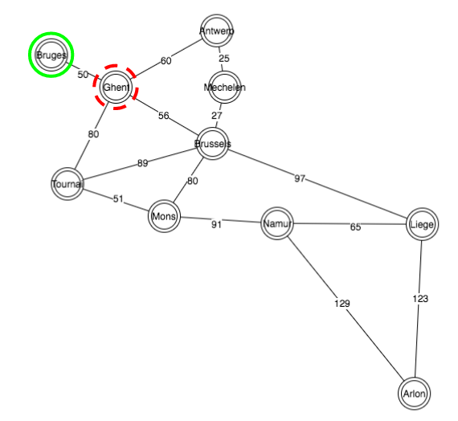
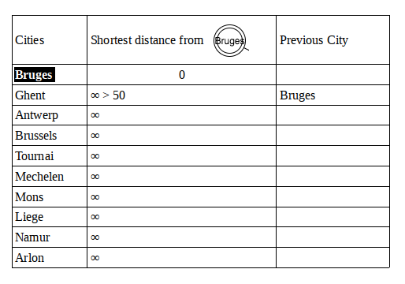

#### Next Step : neighbors of Ghent
Multiple paths, no previous distances to compare, all distances are `saved`.
<br>
```Ruby
visited = [:bruges,:ghent]
unvisited = [:antwerp,:tournai,:mechelen,:brussels,:mons,:namur,:liege,:arlon]
```
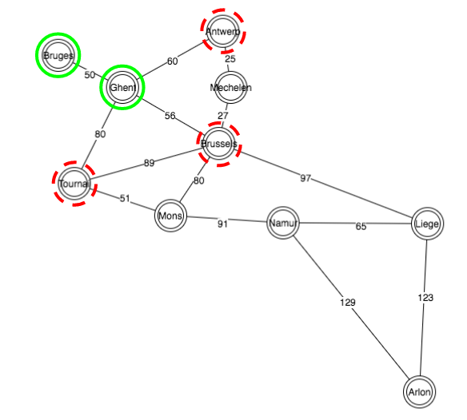
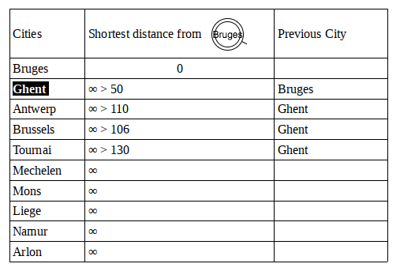

#### Next Step : neighbors of Brussels
Multiple paths, previous distances are compared, only shortest distances are `saved`.
<br>
```Ruby
visited = [:bruges,:ghent,:brussels]
unvisited = [:antwerp,:tournai,:mechelen,:mons,:namur,:liege,:arlon]
```
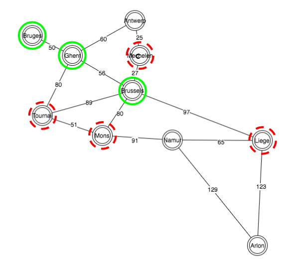
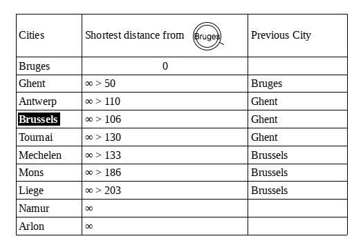

#### Next Step : neighbors of Antwerp
Multiple paths, previous distances are compared, only shortest distances are `saved`.
<br>
```Ruby
visited = [:bruges,:ghent,:brussels,:antwerp]
unvisited = [:tournai,:mechelen,:mons,:namur,:liege,:arlon]
```
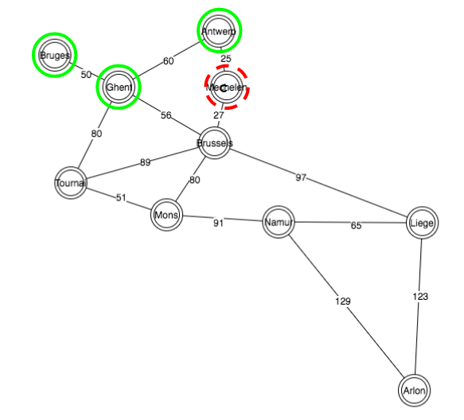
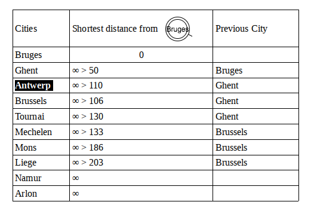

#### Next Step : neighbors of Tournai
Multiple paths, previous distances are compared, only shortest distances are `saved`.
<br>
```Ruby
visited = [:bruges,:ghent,:brussels,:antwerp,:tournai]
unvisited = [:mechelen,:mons,:namur,:liege,:arlon]
```
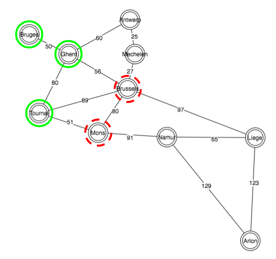
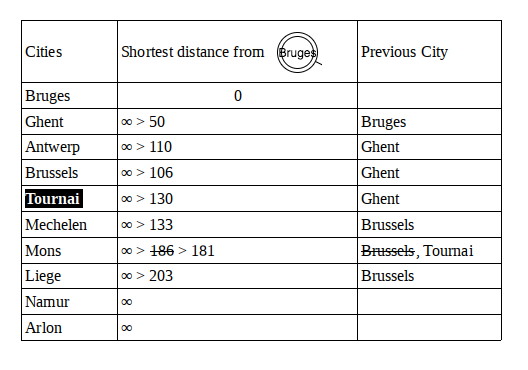

#### Next Step : neighbors of Mechelen
Multiple paths, previous distances are compared, only shortest distances are `saved`.
<br>
```Ruby
visited = [:bruges,:ghent,:brussels,:antwerp,:tournai,:mechelen]
unvisited = [:mons,:namur,:liege,:arlon]
```
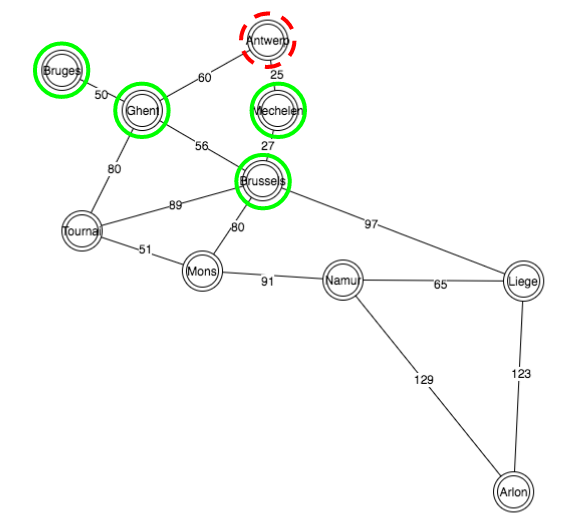
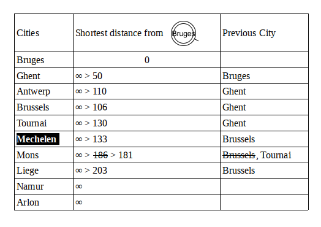

#### Next Step : neighbors of Mons
Multiple paths, previous distances are compared, only shortest distances are `saved`.
<br>
```Ruby
visited = [:bruges,:ghent,:brussels,:antwerp,:tournai,:mechelen,:mons]
unvisited = [:namur,:liege,:arlon]
```
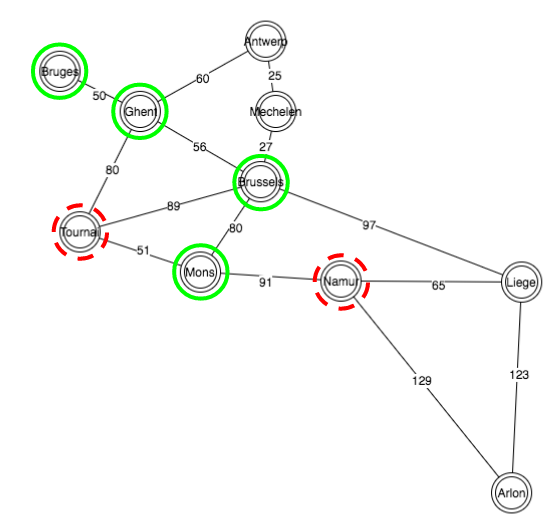
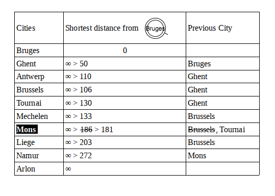

#### Last Step : neighbors of Liege
Multiple paths, previous distances are compared, only shortest distances are `saved`.
<br>
```Ruby
visited = [:bruges,:ghent,:brussels,:antwerp,:tournai,:mechelen,:mons,:liege]
unvisited = [:namur,:arlon]
```
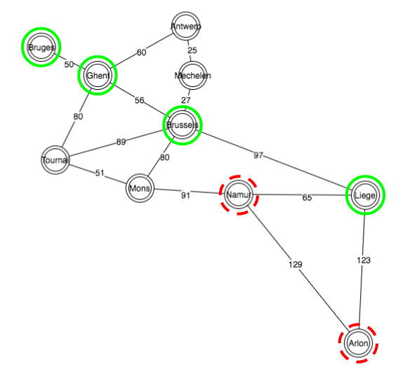
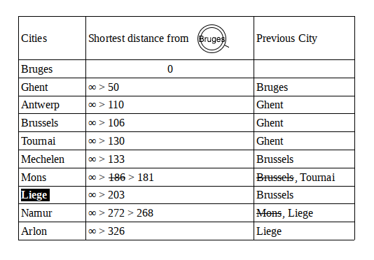

## Conclusion
- For every request, each city with the shortest distance is visited.
- Starting from the *source* city to the *destination* city
- When a city is visited, all its direct neighbors will be visited (in order of ascending distances)
- Each distance is `checked`.
- Every distances are compared to each other.
- Only the shortest distance is `saved`
- For each visited city, the previous city with the shortest distance is `saved`
- The shortest path regroups all the *previous* cities between *destination* and *source*

<br>

## Stop rails server from the command line
Ref. [codementor](https://www.codementor.io/tips/2171438772/stop-rails-server-from-the-command-line)

Sometimes, you get an error while trying to run your rails server saying that, the server is already running and you are not sure where and how the server is running and how to stop that rails server so that you can run the server for the current project. You tried closing the terminal and also tried pressing Ctrl+c but no luck!

In your terminal to find out the PID of the process (assuming your rails server is running on port 3000):
```bash
$ lsof -wni tcp:3000
```

Then, kill the process:

```bash
$ kill -9 PID
```

<br>

## Next feature
Add an interactive Graph using JointJS like [netvlies.nl](https://www.netvlies.nl/tips-updates/applicaties/cases/creating-an-interactive-svg-metro-map-with-jointjs/) qnd/or using [RGL](https://github.com/monora/rgl)
