# Dijkstra
Ruby on Rails project using Dijkstra's algorithm

## Mockup
### Welcome Page

### Selected Country Page

### Algorithm Response

## Specifications
By creating a new Rails app that you will call Dijkstra, I would like you to:
- Find a DB modelization that allows you to store any country given its cities and its roads between them (see Belgian graph);
- Store the Belgian data (see [belgium.rb](belgium.rb));
- Allow a user to select Belgium as a country (or if he/she navigates to /countries/belgium), then allow to select a starting point (a Belgian city) and a destination (also a Belgian city);
- Once the user has selected the starting point and the destination, tell the shortest distance between those two cities;
- Describe to the user the path (for example: Bruges -> Ghent -> Brussels -> Liège) that corresponds to the shortest distance you returned to the user;
- Make your code shines!

### Test and code comprehension
> CODE PLAYGROUND : [belgium.rb](https://code.sololearn.com/cIL8G5BYJvyu)

### Active Record Associations
- a Country has many Cities
- a City belongs to a Country
- a City has many Ways (`from_ways` OR `to_ways`)
- a Way belongs to a City (`city_from_id` OR `city_to_id`)

#### Binding Scenario I
> Irreversible action

When a City is `destroyed` > all depended roads should be `destroyed` too
 
 
When a Road is `destroyed` > only the specific road should be `destroyed`

#### Binding Scenario II
> Safer solution

When a City is `destroyed` > all depended roads should be `archived` and no more available but should still be `edited` and `reestablished`
 
 
When a Road is `destroyed` > only the specific road should be `archived` and no more available but should still be `edited` and `reestablished`
 
## Algorithm explanation
### The shortest distance between Bruges and Liege
#### First Step : no city visited
Initialize the distance as infinite from start city.
 
Visited =[] unvisited=[bruges,ghent,antwerp,tournai,mechelen,brussels,mons,namur,liege,arlon]
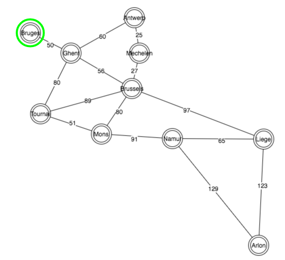
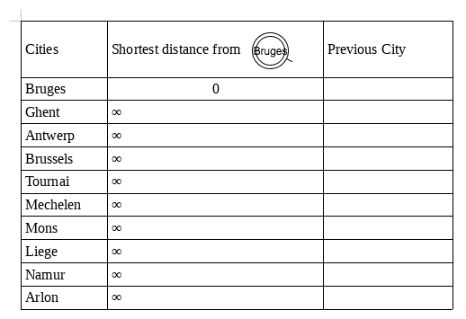
#### Next Step : neighbours of Bruges
Only one path, the shortest distance is `saved`.
 
Visited =[bruges] unvisited=[ghent,antwerp,tournai,mechelen,brussels,mons,namur,liege,arlon]
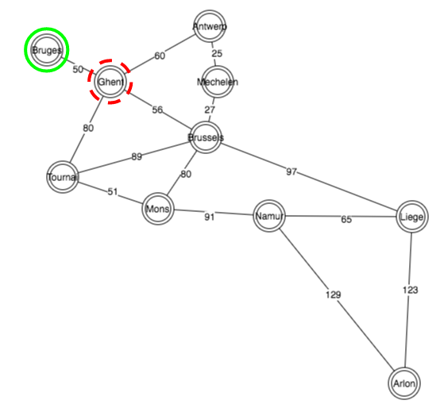
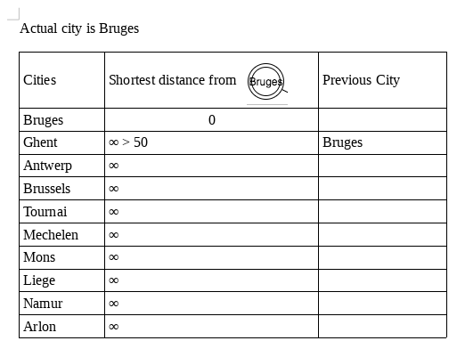
#### Next Step : neighbours of Ghent
Multiple paths, no previous distances to compare, all distances are `saved`.
 
Visited =[bruges,ghent] unvisited=[antwerp,tournai,mechelen,brussels,mons,namur,liege,arlon]
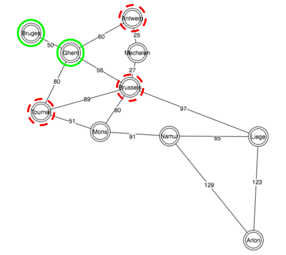
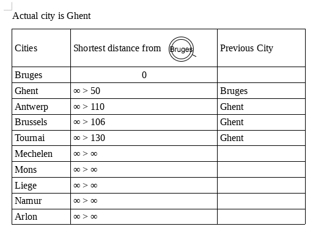
#### Next Step : neighbours of Brussels
Multiple paths, previous distances are compared, only shortest distances are `saved`.
 
Visited =[bruges,ghent,brussels] unvisited=[antwerp,tournai,mechelen,mons,namur,liege,arlon]
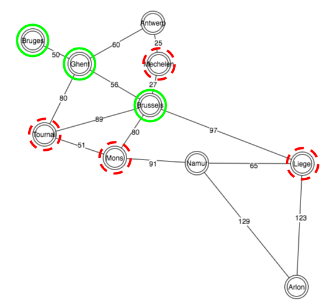
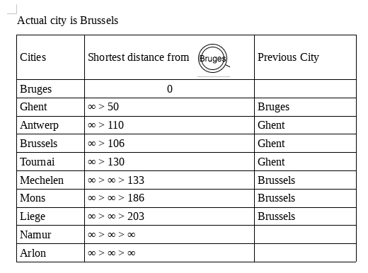
#### Next Step : neighbours of Tournai
Multiple paths, previous distances are compared, only shortest distances are `saved`.
 
Visited =[bruges,ghent,brussels,tournai] unvisited=[antwerp,mechelen,mons,namur,liege,arlon]
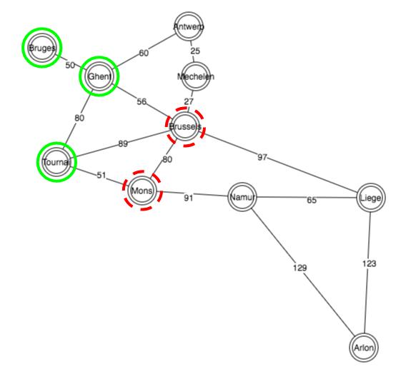
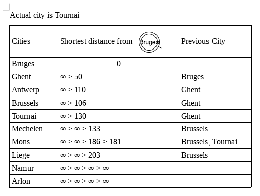
#### Next Step : neighbours of Mons
Multiple paths, previous distances are compared, only shortest distances are `saved`.
 
Visited =[bruges,ghent,brussels,tournai,mons] unvisited=[antwerp,mechelen,namur,liege,arlon]
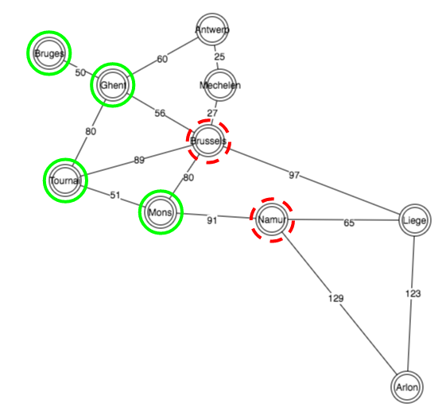
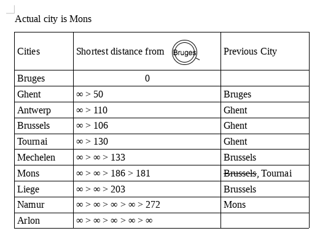
#### Next Step : neighbours of Namur
Multiple paths, previous distances are compared, only shortest distances are `saved`.
 
Visited =[bruges,ghent,brussels,tournai,mons,namur] unvisited=[antwerp,mechelen,liege,arlon]
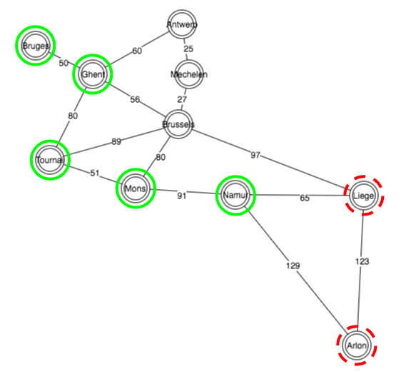
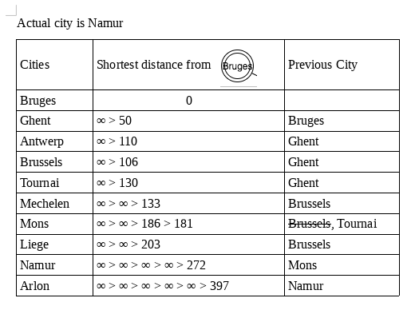
#### Last Step : neighbours of Liege
Multiple paths, previous distances are compared, only shortest distances are `saved`.
 
Visited =[bruges,ghent,brussels,tournai,mons,namur,antwerp,mechelen,arlon,liege] unvisited=[]
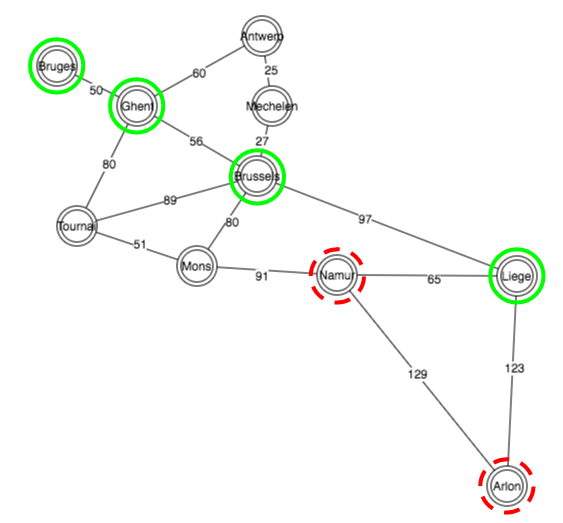
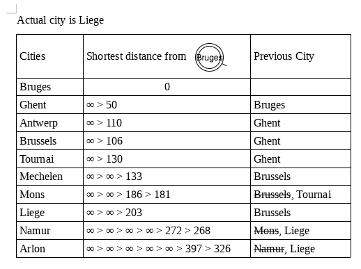
### Conclusion
- For every request, each city is visited.
- Each distance is `saved`.
- Every distance is compared to each other.
- Only the shortest distance between each city is `saved`
