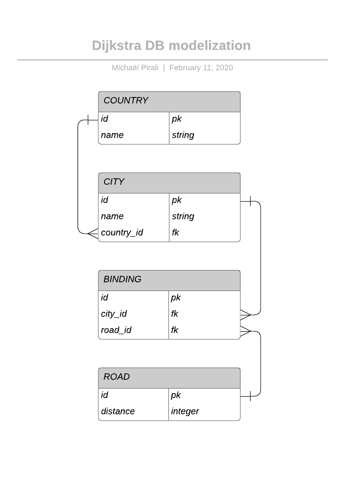

# Dijkstra
Ruby on Rails project using Dijkstra's algorithm

### Active Record Associations
- a Country has many Cities
- a City belongs to a Country
- a City has many Roads
- a Road has many Cities (always 2)
 
When a City is `destroyed` > all depended roads should be `destroyed` too
When a Road is `destroyed` > only the specific road should be `destroyed`
